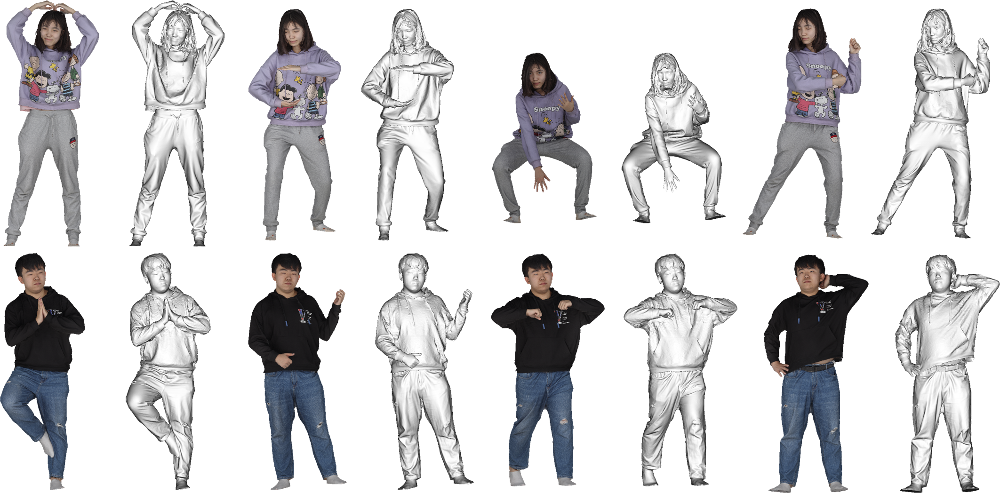

# THUman3.0 Dataset
### DeepCloth: Neural Garment Representation for Shape and Style Editing
Zhaoqi Su, Tao Yu, Yangang Wang, Yebin Liu.  TPAMI 2022

[[Project Page]](http://www.liuyebin.com/DeepCloth/DeepCloth.html)



NOTE: For privacy protection, please blur the faces if the images or the models appear in any materials that will be published (such as paper, video, poster, etc.)

### Agreement
1. The THUman3.0 dataset (the "Dataset") is available for **non-commercial** research purposes only. Any other use, in particular any use for commercial purposes, is prohibited. This includes, without limitation, incorporation in a commercial product, use in a commercial service, as training data for a commercial product, for commercial ergonomic analysis (e.g. product design, architectural design, etc.), or production of other artifacts for commercial purposes including, for example, web services, movies, television programs, mobile applications, or video games. The dataset may not be used for pornographic purposes or to generate pornographic material whether commercial or not. The Dataset may not be reproduced, modified and/or made available in any form to any third party without Tsinghua University’s prior written permission.

2. You agree **not to** reproduce, modified, duplicate, copy, sell, trade, resell or exploit any portion of the images and any portion of derived data in any form to any third party without Tsinghua University’s prior written permission.

3. You agree **not to** further copy, publish or distribute any portion of the Dataset. Except, for internal use at a single site within the same organization it is allowed to make copies of the dataset.

4. Tsinghua University reserves the right to terminate your access to the Dataset at any time.


### Download Instructions 
The dataset is encrypted to prevent unauthorized access.

Please fill the [request form](./THUman3.0_Agreement.pdf) and send it to Yebin Liu (liuyebin@mail.tsinghua.edu.cn) and cc Zhaoqi Su (suzq13@tsinghua.org.cn) to request the download link. 

By requesting for the link, you acknowledge that you have read the agreement, understand it, and agree to be bound by them. If you do not agree with these terms and conditions, you must not download and/or use the Dataset.


### Data Explanation
THuman3.0 Dataset contains 20 combinations of human-garment, each contains 15 to 35 high-quality human scans captured by a dense DLSR rig.
For each scan, we provide the 3D model (****.obj) along with the corresponding texture map (tex.png).


### Related Datasets from THU3DV Lab [[Link]](http://liuyebin.com/)
[[MultiHuman Dataset]](https://github.com/y-zheng18/MultiHuman-Dataset/) Containing 453 high-quality scans, each contains 1-3 persons. The dataset can be used to train and evaluate multi-person reconstruction algorithms.

[[THuman2.0 Dataset]](https://github.com/ytrock/THuman2.0-Dataset) Containing 500 high-quality human scans captured by a dense DLSR rig, with SMPL-X fitting parameters. 

[[THuman Dataset]](https://github.com/ZhengZerong/DeepHuman/tree/master/THUmanDataset) Containing 6k (200 subjects x 30 poses) scans from a single RGBD sensor, with SMPL annotations. 


### Citation
If you use this dataset for your research, please consider citing:
```
@article{deepcloth_su2022,
  author={Su, Zhaoqi and Yu, Tao and Wang, Yangang and Liu, Yebin},
  journal={IEEE Transactions on Pattern Analysis and Machine Intelligence}, 
  title={DeepCloth: Neural Garment Representation for Shape and Style Editing}, 
  year={2023},
  volume={45},
  number={2},
  pages={1581-1593},
  doi={10.1109/TPAMI.2022.3168569}
}
```

### Contact
- Zhaoqi Su [(suzq13@tsinghua.org.cn)](mailto:suzq13@tsinghua.org.cn)
- Yebin Liu [(liuyebin@mail.tsinghua.edu.cn)](mailto:liuyebin@mail.tsinghua.edu.cn)
